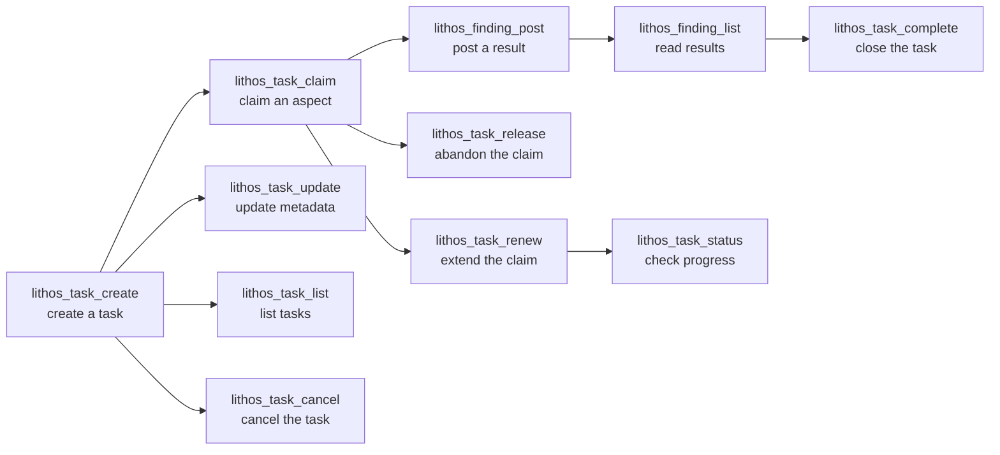

# Coordination Tools

Full reference for Lithos's multi-agent coordination primitives.

For a usage guide with examples and the full workflow diagram, see [lithos_task_status](lithos_task_status.md).

---

## Overview

Lithos provides **TTL-based task claiming** — a lightweight distributed locking mechanism that lets agents divide work without a central orchestrator.



---

## Tool Summary

| Tool | Purpose |
|------|---------|
| `lithos_task_create` | Create a named task |
| `lithos_task_update` | Update task metadata (title, description, tags) |
| `lithos_task_claim` | Claim an aspect (distributed lock with TTL) |
| `lithos_task_renew` | Extend a claim before expiry |
| `lithos_task_release` | Release a claim early |
| `lithos_task_complete` | Mark task done, release all claims |
| `lithos_task_cancel` | Cancel a task, releasing all active claims |
| `lithos_task_list` | List tasks with optional filters |
| `lithos_task_status` | Query task state and active claims |
| `lithos_finding_post` | Post a finding (result) to a task |
| `lithos_finding_list` | List findings for a task |

---

## Reference

### lithos_task_create

**Arguments:**

| Name | Type | Required | Description |
|------|------|:--------:|-------------|
| `title` | string | ✅ | Task title |
| `agent` | string | ✅ | Creating agent |
| `description` | string | — | Longer description |
| `tags` | string[] | — | Task tags for filtering |

**Returns:** `{ "task_id": "task-abc123" }`

---

### lithos_task_update

Update mutable task metadata without closing the task. At least one of `title`, `description`, or `tags` must be provided.

**Arguments:**

| Name | Type | Required | Description |
|------|------|:--------:|-------------|
| `task_id` | string | ✅ | Task ID to update |
| `agent` | string | ✅ | Agent making the update |
| `title` | string | — | New task title |
| `description` | string | — | New task description |
| `tags` | string[] | — | New task tags (replaces existing tags) |

**Returns:** `{ "success": true, "message": "Task task-abc123 updated" }` or `{ "status": "error", "code": "task_not_found" }`

---

### lithos_task_cancel

Cancel a task, releasing all active claims on it. Use this when a task should be abandoned entirely — it cannot be resumed after cancellation.

**Arguments:**

| Name | Type | Required | Description |
|------|------|:--------:|-------------|
| `task_id` | string | ✅ | Task ID |
| `agent` | string | ✅ | Agent cancelling the task |
| `reason` | string | — | Optional reason for cancellation |

**Returns:** `{ "success": true }` or `{ "status": "error", "code": "task_not_found" }`

!!! note "Cancelled vs completed"
    Use `lithos_task_cancel` for tasks that are being abandoned. Use `lithos_task_complete` for tasks that have been successfully finished. Both close the task and release all claims, but the final `status` differs (`"cancelled"` vs `"completed"`).

---

### lithos_task_list

List tasks with optional filters. Useful for discovering open work, auditing completed tasks, or monitoring coordination activity.

**Arguments:**

| Name | Type | Required | Description |
|------|------|:--------:|-------------|
| `agent` | string | — | Filter to tasks created by this agent |
| `status` | string | — | Filter by status: `"open"`, `"completed"`, or `"cancelled"` (omit for all) |
| `tags` | string[] | — | Filter to tasks that have **all** of these tags |
| `since` | string | — | Filter to tasks created at or after this ISO 8601 datetime (e.g. `"2024-01-01T00:00:00Z"`) |

**Returns:**

```json
{
  "tasks": [
    {
      "id": "task-abc123",
      "title": "Research rate limiting strategies",
      "description": "Survey common approaches...",
      "status": "open",
      "created_by": "research-agent",
      "created_at": "2026-03-19T10:00:00Z",
      "tags": ["research", "api"]
    }
  ]
}
```

**Example — find all open tasks:**

```python
result = lithos_task_list(status="open")
for task in result["tasks"]:
    print(f"[{task['id']}] {task['title']} — created by {task['created_by']}")
```

---

### lithos_task_claim

Attempt to claim an *aspect* of a task. Aspect names are free-form strings — use them to describe what part of the work you're taking on. If another agent already holds a claim on the same aspect, the call fails.

**Arguments:**

| Name | Type | Required | Description |
|------|------|:--------:|-------------|
| `task_id` | string | ✅ | Task ID |
| `aspect` | string | ✅ | What aspect you're claiming (e.g., `"research"`, `"implementation"`, `"review"`) |
| `agent` | string | ✅ | Your agent ID |
| `ttl_minutes` | int | — | Claim duration (default: `60`, max: `480`) |

**Returns:** `{ "success": true, "expires_at": "..." }` or `{ "status": "error", "code": "claim_failed" }`

!!! tip "Aspect naming"
    Aspects should be specific enough to avoid unintentional conflicts. `"implementation"` is fine if only one agent will implement. If multiple agents might work in parallel, use `"implementation:module-a"` and `"implementation:module-b"`.

---

### lithos_task_renew

Extend a claim you hold. Only the agent that holds the claim can renew it.

**Arguments:**

| Name | Type | Required | Description |
|------|------|:--------:|-------------|
| `task_id` | string | ✅ | Task ID |
| `aspect` | string | ✅ | The aspect you claimed |
| `agent` | string | ✅ | Your agent ID |
| `ttl_minutes` | int | — | New duration from now (default: `60`, max: `480`) |

**Returns:** `{ "success": true, "new_expires_at": "..." }` or `{ "status": "error", "code": "claim_not_found" }`

Renew before expiry — once a claim expires, another agent can take it.

---

### lithos_task_release

Release a claim early. Use this if you're abandoning the work so another agent can pick it up.

**Arguments:**

| Name | Type | Required | Description |
|------|------|:--------:|-------------|
| `task_id` | string | ✅ | Task ID |
| `aspect` | string | ✅ | The aspect to release |
| `agent` | string | ✅ | Your agent ID |

**Returns:** `{ "success": true }` or `{ "status": "error", "code": "claim_not_found" }`

---

### lithos_task_complete

Mark a task as completed. This also releases all active claims on the task.

Optionally supply LCMA retrieval feedback (`cited_nodes`, `misleading_nodes`) to reinforce or penalise documents that were retrieved during the task. Feedback is validated against the audit receipt from the most recent `lithos_retrieve` call for this task.

**Arguments:**

| Name | Type | Required | Description |
|------|------|:--------:|-------------|
| `task_id` | string | ✅ | Task ID |
| `agent` | string | ✅ | Agent marking completion |
| `outcome` | string | — | Optional outcome summary. Persisted on the task row and forwarded in the `task.completed` event for LCMA consolidation. |
| `cited_nodes` | string[] | — | Document UUIDs the agent found useful. Drives salience reinforcement. `null` = no feedback. |
| `misleading_nodes` | string[] | — | Document UUIDs the agent found misleading. Drives salience penalty. `null` = no feedback. |
| `receipt_id` | string | — | Specific `lithos_retrieve` receipt to bind feedback to. If omitted, the latest receipt for this task/agent is used. |

**Returns:** `{ "success": true }` or `{ "status": "error", "code": "task_not_found" }`

**Example:**

```python
lithos_task_complete(
    task_id="task-abc123",
    agent="research-agent",
    outcome="Found 3 viable rate-limiting strategies; documented in knowledge base."
)
```

**Example with LCMA feedback:**

```python
# After using lithos_retrieve, report which documents helped
results = lithos_retrieve(query="rate limiting", task_id="task-abc123", agent_id="research-agent")
receipt_id = results["receipt_id"]

lithos_task_complete(
    task_id="task-abc123",
    agent="research-agent",
    outcome="Completed research.",
    cited_nodes=["uuid-of-helpful-doc-1", "uuid-of-helpful-doc-2"],
    misleading_nodes=["uuid-of-bad-doc"],
    receipt_id=receipt_id
)
```

!!! info "Feedback is validated against the receipt"
    Node IDs not present in the receipt (i.e. documents that were never retrieved in this session) are silently ignored. This prevents agents from manipulating salience scores for arbitrary documents.

---

### lithos_finding_post

Post a finding to a task. Use this to report results — optionally linking to a knowledge item you've written.

**Arguments:**

| Name | Type | Required | Description |
|------|------|:--------:|-------------|
| `task_id` | string | ✅ | Task ID |
| `agent` | string | ✅ | Your agent ID |
| `summary` | string | ✅ | Brief summary of the finding |
| `knowledge_id` | string | — | UUID of a `lithos_write` result, if you created a knowledge item |

**Returns:** `{ "finding_id": "finding-xyz789" }`

---

### lithos_finding_list

List findings for a task.

**Arguments:**

| Name | Type | Required | Description |
|------|------|:--------:|-------------|
| `task_id` | string | ✅ | Task ID |
| `since` | string | — | Only findings after this ISO 8601 timestamp |

**Returns:**

```json
{
  "findings": [
    {
      "id": "finding-xyz789",
      "agent": "research-agent",
      "summary": "mem0 lacks task claiming and Markdown storage",
      "knowledge_id": "uuid-of-mem0-analysis",
      "created_at": "2026-03-18T12:30:00Z"
    }
  ]
}
```
